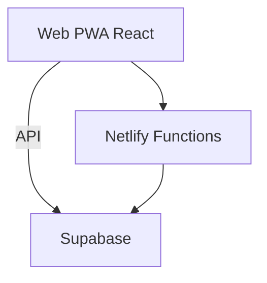

# Dossier technique et securite - EMSP Allons

## 1) Architecture
- Frontend: React + Vite + Tailwind
- Backend: Supabase (Auth + Postgres + Storage)
- Hosting: Netlify (build + functions)

## 2) Services & APIs
- Supabase Auth: login, reset, confirmation email.
- Supabase DB: subscribers, payments, qr_codes, lines, controllers.
- Netlify Functions:
  - admin-create-user
  - admin-reset-password
  - send-whatsapp (link)

## 3) Securite
- RLS active sur tables sensibles.
- Service role utilise uniquement dans fonctions Netlify.
- Variables sensibles stockees dans Netlify.
- Politique de mot de passe + changement obligatoire.

## 4) Logs et audit
- system_history, reminders_log, scan_logs.
- Triggers SQL possibles pour journalisation automatique.

## 5) Maintenance
- Migrations SQL dans supabase/migrations.
- Deploy via Netlify (CLI ou UI).
- Sauvegardes via export JSON.

## 6) Dependances principales
- @supabase/supabase-js
- react, react-dom
- tailwindcss
- xlsx
- lucide-react

## 7) Configuration requise
Netlify env:
- SUPABASE_URL
- SUPABASE_SERVICE_ROLE_KEY
- VITE_SUPABASE_URL
- VITE_SUPABASE_ANON_KEY

Supabase Auth:
- Site URL: domaine Netlify
- Redirect URLs: /reset-password, /auth/callback

## 8) Audit technique (resume)
### Points corriges
- Creation user via fonction serveur + insertion educators.
- Reset password admin via service role.
- Pages reset/confirmation en production.
- WhatsApp gratuit + copier message.

### Risques restants
- Chunks JS volumineux (performance mobile).
- Absence de monitoring temps reel.

### Recommandations
- Ajouter monitoring (Sentry).
- Mettre en place alertes erreurs.
- Optimiser bundle Vite.

## 9) Plan d'exploitation
- Backup hebdomadaire.
- Verification mensuelle des logs.
- Audit securite trimestriel.
