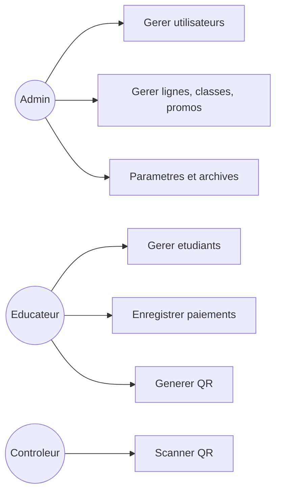
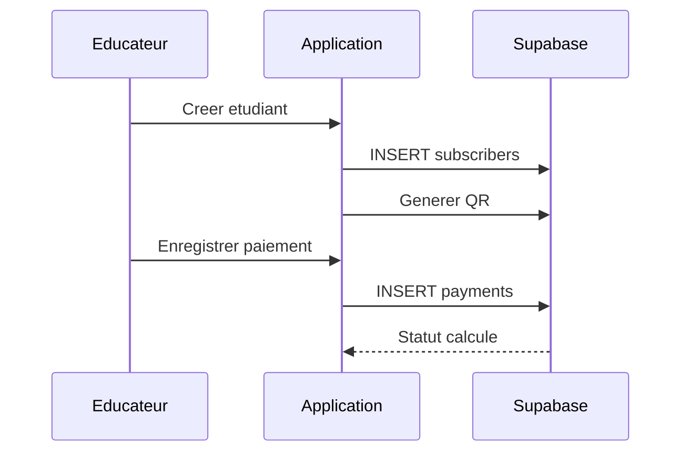
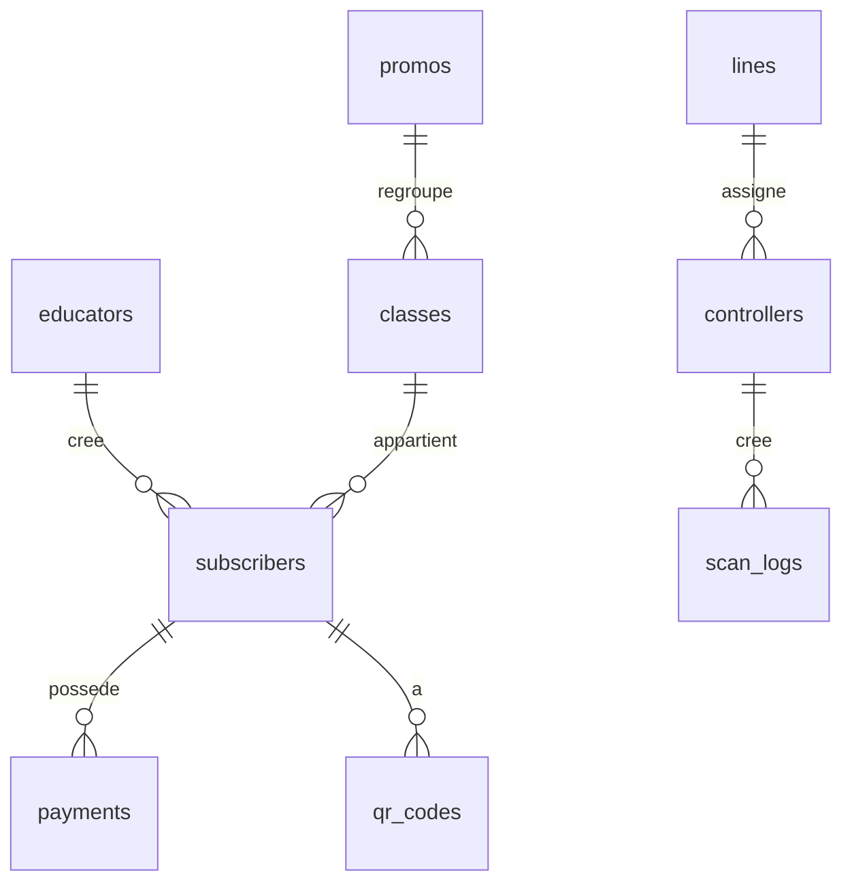

# Guide d'utilisation - EMSP Allons

## 1) Objectif
EMSP Allons est une plateforme de gestion des abonnements de transport scolaire.
Elle permet de gerer les etudiants, les paiements, les QR codes, les scans et les rappels WhatsApp.

## 2) Roles et droits
- Admin: gestion complete (utilisateurs, lignes, classes, promos, parametres, export/import, archives).
- Educateur: gestion des etudiants + paiements + QR codes. Pas de creation d'utilisateurs.
- Controleur: scan QR et verification des etudiants de sa ligne uniquement.

## 3) Demarrage initial (premiere utilisation)
1. Creer le compte Administrateur (Configuration initiale).
2. Configurer les lignes de car (Lignes).
3. Configurer classes et promos (Classes & Promos).
4. Verifier les parametres (mois hors service, templates WhatsApp, etc.).

## 4) Interface et navigation
- Barre haute: acces rapide aux modules (Controleurs, Lignes, Classes, Notice, Rappels, Parametres, Export/Import, Utilisateurs).
- Onglets principaux: Apercu, Etudiants, Bilan mensuel, Archives.

## 5) Gestion des etudiants
### Creation
Champs obligatoires:
- Nom, Contact (+225 pre-rempli), Classe, Promo, Ligne, Point de ramassage.

### Regles
- Classe et promo viennent des listes (pas de saisie libre).
- Ligne obligatoire (impacte les scans controleurs).

## 6) Gestion des paiements
- Choix du nombre de mois (1,2,3,5,6,12).
- Calcul automatique de la date d'expiration.
- Periode de grace de 5 jours.
- Statuts: ACTIF, EXPIRE_BIENTOT, RETARD, EXPIRE, AUCUN.

## 7) QR codes
- Generation automatique a l'inscription.
- Regeneration possible.
- Envoi via WhatsApp (message pre-rempli + QR telecharge).

## 8) Controleurs / Scan
- Chaque controleur est rattache a une ligne.
- Un controleur ne peut scanner que les etudiants de sa ligne.
- En cas de double scan proche, une alerte est affichee.

## 9) Rappels WhatsApp (gratuit)
- Ouverture WhatsApp avec message pre-rempli.
- Bouton Copier pour reutiliser le message.
- Envoi en lot avec pause automatique.

## 10) Export / Import
- Export CSV et Excel (.xlsx) pour etudiants et paiements.
- Import CSV / Excel pour integration rapide.

## 11) Archivage annuel
- Permet de demarrer une nouvelle annee scolaire.
- Conserve l'historique dans les archives.

## 12) Regles de gestion (detail)
### Mots de passe
- Minimum 6 caracteres.
- Confirmation obligatoire.
- Admin peut reinitialiser le mot de passe d'un educateur.
- Compte cree par admin: changement obligatoire a la premiere connexion.

### Utilisateurs
- Au moins un admin doit exister.
- Un utilisateur ne peut pas modifier le role du dernier admin.
- L'educateur ne peut pas creer d'autres comptes.

### Lignes
- Lignes gerees par admin.
- Une ligne est obligatoire pour chaque etudiant.

### Controleurs
- Controleur lie a une ligne a la creation.
- Acces scan limite aux etudiants de sa ligne.

### Classes et promos
- Classes et promos gerees par admin.
- Saisie via listes deroulantes.

### Etudiants
- Nom, contact, ligne, classe, promo obligatoires.
- QR code genere automatiquement.

### Paiements
- Statuts calcule en temps reel.
- Periode de grace 5 jours.
- Mois hors service exclus des rappels.

### Rappels
- WhatsApp manuel (gratuit) avec message pre-rempli.
- Envoi en lot possible.

## 13) UML / UX
### Cas d'utilisation (UML)

### Sequence - Creation et paiement

### UX - Parcours utilisateur
- Admin: Accueil -> Parametres -> Lignes/Classes -> Utilisateurs -> Etudiants.
- Educateur: Accueil -> Etudiants -> Paiements -> QR.
- Controleur: Scan QR -> Statut immediat.

## 14) Schema de donnees (detail)
### Tables principales
- educators: id, name, email, role, active, must_change_password, created_by, created_at.
- subscribers: id, first_name, last_name, promo, class, bus_line, pickup_point, guardian, phone, email, notes, status, created_at.
- payments: id, subscriber_id, total_amount, number_of_months, monthly_fee, period_start, period_end, grace_end, created_by, bus_line.
- qr_codes: id, subscriber_id, token, status, expires_at.
- controllers: id, name, code, password, assigned_line_id, active.
- scan_logs: id, student_id, controller_id, status, created_at.
- scan_locks: id, token, line, locked_at.
- lines, classes, promos.
- reminders_config, reminders_log.
- system_history, subscription_history, school_photos.

### Vue / triggers
- v_student_status: statut calcule cote DB.
- triggers payments -> system_history.

## 15) Erreurs courantes
- \"Configuration Supabase manquante\": verifier variables Netlify.
- \"Numero WhatsApp invalide\": format +225 obligatoire.
- \"Utilisateur introuvable\": verifier table educators.
